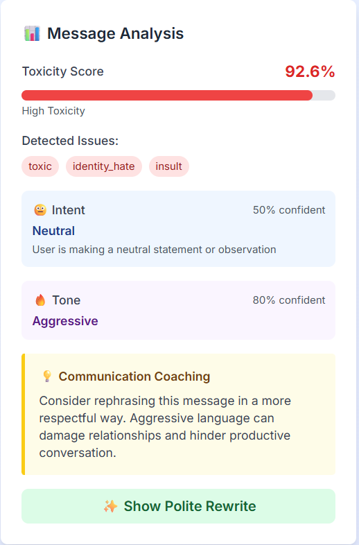

# Group Chat Realtime

Real-time group chat with AI-assisted moderation. The app combines a FastAPI backend, a Next.js frontend, WebSocket chat, authentication, and message analysis for toxicity, intent, and tone.


## What this project does

- Real-time chat rooms with live messaging
- User authentication with JWT tokens
- AI moderation signals for toxic language, intent, and tone
- Message editing, reactions, pinning, and room management features
- Profile views and user room access controls

## Project Structure

- `backend/` FastAPI application, models, ML helpers, and database setup
- `frontend/` Next.js application and UI components
- `datasets/` training and reference data used by moderation models
 
4. Start the API server.

Example:

```bash
cd backend
python -m venv .venv
.venv\Scripts\activate
pip install -r requirements.txt
uvicorn main:app --host 0.0.0.0 --port 8000 --reload
```

The backend reads its database connection from `DATABASE_URL`. SQLite is the easiest local option, while PostgreSQL is recommended for deployed environments.

## Frontend Setup

1. Install dependencies in `frontend/`.
2. Point the app at your backend API and WebSocket server.
3. Start the development server.

Example:

```bash
cd frontend
npm install
npm run dev
```

Set these environment variables for the frontend when needed:

- `NEXT_PUBLIC_API_URL` for the REST API base URL
- `NEXT_PUBLIC_WS_URL` for the WebSocket base URL

## Environment Variables

The backend expects values such as:

- `DATABASE_URL`
- `SECRET_KEY`
- `FRONTEND_URL`
- `OPENAI_API_KEY`
- `CLOUDINARY_CLOUD_NAME`
- `CLOUDINARY_API_KEY`
- `CLOUDINARY_API_SECRET`

Use `backend/.env.example` as the starting point, then replace any placeholder or local-only values before running the app.

## Useful Commands

Backend:

```bash
cd backend
uvicorn main:app --host 0.0.0.0 --port 8000 --reload
```

Frontend:

```bash
cd frontend
npm run dev
npm run build
npm start
```

## Deployment Notes

The repo includes deployment guidance in `docs/DEPLOYMENT.md`. For production, make sure to:

- Use a real database instead of the default SQLite file
- Set a strong `SECRET_KEY`
- Configure CORS for your deployed frontend origin
- Verify `NEXT_PUBLIC_API_URL` and `NEXT_PUBLIC_WS_URL`
- Avoid loading heavy ML components at startup if your hosting plan has tight memory limits

### Railway Deployment Quick Start

Use Railway for the backend, and keep the Next.js frontend on Vercel or another static/Node host.

Backend service settings:

- Root Directory: `backend`
- Build Command: `python -m pip install -r requirements.txt`
- Start Command: `python -m uvicorn main:app --host 0.0.0.0 --port $PORT`

If Railway ignores the root directory, set the commands as:

- Build Command: `cd backend && python -m pip install -r requirements.txt`
- Start Command: `cd backend && python -m uvicorn main:app --host 0.0.0.0 --port $PORT`

Recommended Railway environment variables:

- `DATABASE_URL` = PostgreSQL connection string from Railway
- `SECRET_KEY` = strong random secret
- `ENABLE_TOXICITY_MODEL` = `false`
- `FRONTEND_URL` = your deployed frontend URL
- `OPENAI_API_KEY` = optional, if you use OpenAI features

After backend deploys, set your frontend environment variables to the Railway backend URL:

- `NEXT_PUBLIC_API_URL` = `https://<your-railway-backend-domain>`
- `NEXT_PUBLIC_WS_URL` = `wss://<your-railway-backend-domain>`

## API Documentation

See `docs/API.md` for endpoint examples and response shapes.

## Notes

- The backend is built around FastAPI, SQLAlchemy, JWT auth, and WebSockets.
- The frontend uses the Next.js App Router and Tailwind CSS.
- Some moderation components are optional and may fall back to lighter behavior if model loading fails.

## Featured Projects

### 1. ShopWave - Full Stack eCommerce Platform

A complete eCommerce platform with user shopping experience and admin management system.

Tech Stack:
- React.js
- Node.js
- Express.js
- PostgreSQL
- Stripe

Live Demo: Add project link
GitHub: Add GitHub link

### 2. Group Chat Realtime

Real-time chat application with secure authentication and AI-powered moderation.

Tech Stack:
- Next.js
- FastAPI
- WebSocket
- Python
- PostgreSQL

Live Demo: Add project link
GitHub: Add GitHub link

### 3. Fake News Detection System

Machine learning based web application that detects fake news content.

Tech Stack:
- Python
- Scikit-learn
- NLP

Live Demo: Add project link
GitHub: Add GitHub link

## Screenshots

- **Primary UI captures**





- **Additional captures (screenchots/)**


> Note: Images are referenced from the repository paths `screenshots/` and `screenchots/`.