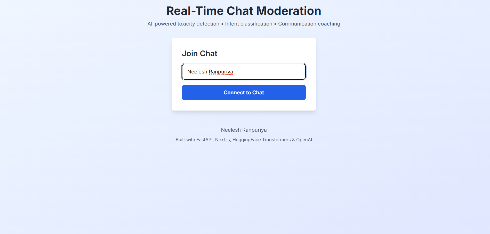
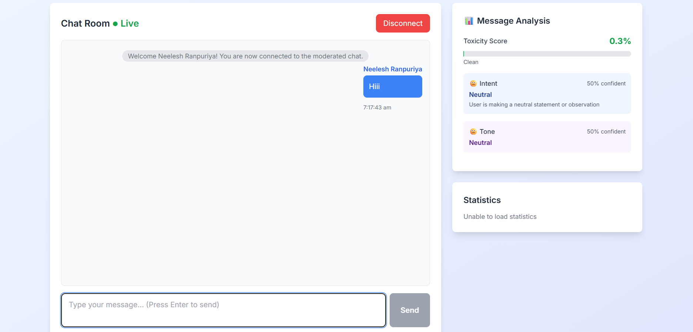
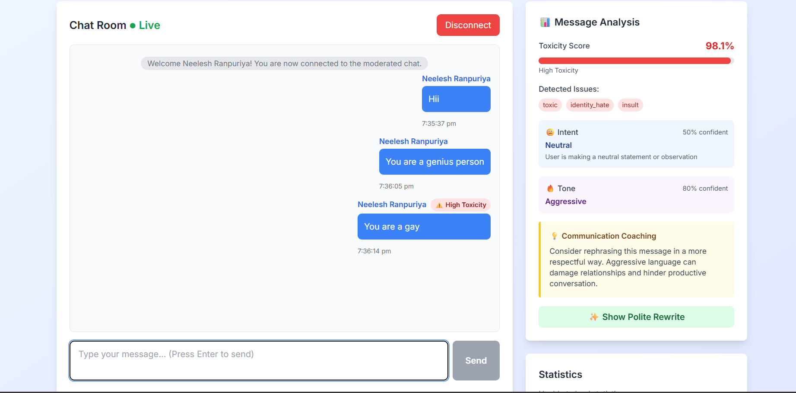

# Real-time-chat-moderation-
An AI-powered real-time chat moderation platform built with FastAPI and WebSockets that detects toxic messages, classifies intent, analyzes tone, and provides polite coaching suggestions instantly.

##  Project Overview  

<<<<<<< HEAD
## 📋 Project Overview

A comprehensive real-time chat moderation system that uses artificial intelligence to:
- **Detect toxicity** in messages with confidence scores
- **Classify intent** (questions, complaints, insults, threats, etc.)
- **Analyze tone** (polite, rude, aggressive, passive-aggressive)
- **Provide coaching** for better communication
- **Suggest rewrites** for toxic/rude messages
- **Monitor in real-time** using WebSocket connections

## ✨ Key Features

### 🤖 AI-Powered Analysis
- **Toxicity Detection**: HuggingFace transformer model (toxic-bert)
- **Intent Classification**: Pattern-based classifier with 7 intent types
- **Tone Analysis**: OpenAI GPT-3.5 powered analysis
- **Communication Coaching**: Real-time feedback and suggestions
- **Polite Rewrites**: AI-generated professional alternatives

### 💬 Real-Time Chat
- WebSocket-based instant messaging
- Live moderation and analysis
- Multi-user support
- System notifications

### 📊 Analytics Dashboard
- Live statistics and metrics
- Toxicity rate tracking
- Intent and tone breakdowns
- Active user monitoring

### 🎯 Admin Features
- Message history with full analysis
- Moderation actions (delete messages)
- Statistical reports
- REST API for integrations

## 🚀 Tech Stack

### Backend
- **FastAPI** - Modern Python web framework
- **WebSockets** - Real-time bidirectional communication
- **PostgreSQL/SQLite** - Database (configurable)
- **SQLAlchemy** - ORM for database operations
- **Uvicorn** - ASGI server

### AI/ML Models
- **HuggingFace Transformers** - `unitary/toxic-bert` for toxicity detection
- **OpenAI GPT-3.5** - Tone analysis and rewrite generation
- **Custom Intent Classifier** - Pattern-based classification
- **PyTorch** - Deep learning framework

### Frontend
- **Next.js 14** - React framework
- **TypeScript** - Type-safe JavaScript
- **Tailwind CSS** - Utility-first CSS framework
- **WebSocket Client** - Real-time messaging
- **Axios** - HTTP client

### Datasets
- Jigsaw Toxic Comment Classification Dataset
- Custom intent classification dataset (40 samples)
- Custom polite rewrites dataset (40 samples)

## 📁 Project Structure

```
webapp/
├── backend/                 # FastAPI backend
│   ├── main.py             # Main application entry
│   ├── models.py           # Database models
│   ├── database.py         # Database configuration
│   ├── toxicity_detector.py # Toxicity detection module
│   ├── intent_classifier.py # Intent classification
│   ├── tone_analyzer.py    # Tone analysis & coaching
│   ├── requirements.txt    # Python dependencies
│   └── .env.example        # Environment variables template
│
├── frontend/               # Next.js frontend
│   ├── app/
│   │   ├── page.tsx       # Main chat page
│   │   ├── layout.tsx     # App layout
│   │   ├── globals.css    # Global styles
│   │   └── components/    # React components
│   │       ├── ChatMessage.tsx
│   │       ├── MessageInput.tsx
│   │       ├── AnalysisPanel.tsx
│   │       └── StatsPanel.tsx
│   ├── package.json       # Node dependencies
│   └── next.config.js     # Next.js configuration
│
├── datasets/              # Training/demo datasets
│   ├── toxic_comments.csv
│   ├── intent_classification.csv
│   ├── polite_rewrites.csv
│   └── README.md
│
├── docs/                  # Documentation
│   ├── API.md            # API documentation
│   ├── DEPLOYMENT.md     # Deployment guide
│   └── ARCHITECTURE.md   # System architecture
│
└── README.md             # This file
```

## 🔧 Installation & Setup

### Prerequisites
- Python 3.8+ (for backend)
- Node.js 18+ (for frontend)
- PostgreSQL (optional, SQLite works too)
- OpenAI API key (optional, fallback available)

### Backend Setup

1. **Navigate to backend directory:**
```bash
cd backend
```

2. **Create virtual environment:**
```bash
python -m venv venv
source venv/bin/activate  # On Windows: venv\Scripts\activate
```

3. **Install dependencies:**
```bash
pip install -r requirements.txt
```

4. **Configure environment:**
```bash
cp .env.example .env
# Edit .env and add your OpenAI API key
```

5. **Initialize database:**
```bash
python -c "from database import init_db; init_db()"
```

6. **Run backend server:**
```bash
python main.py
# Or using uvicorn directly:
uvicorn main:app --host 0.0.0.0 --port 8000 --reload
```

Backend will be available at: http://localhost:8000

### Frontend Setup

1. **Navigate to frontend directory:**
```bash
cd frontend
```

2. **Install dependencies:**
```bash
npm install
```

3. **Configure environment (optional):**
```bash
# Create .env.local if needed
echo "NEXT_PUBLIC_API_URL=http://localhost:8000" > .env.local
echo "NEXT_PUBLIC_WS_URL=ws://localhost:8000" >> .env.local
```

4. **Run development server:**
```bash
npm run dev
```

Frontend will be available at: http://localhost:3000

## 🎮 Usage

### Starting the Chat

1. Open http://localhost:3000 in your browser
2. Enter a username
3. Click "Connect to Chat"
4. Start sending messages!

### Understanding the Analysis

Each message you send gets analyzed in real-time:

- **Toxicity Score**: 0-100% (higher = more toxic)
- **Intent**: question, complaint, insult, threat, positive, disagreement, neutral
- **Tone**: polite, rude, aggressive, passive-aggressive, sarcastic, neutral
- **Coaching**: Constructive feedback if message is problematic
- **Rewrite**: Polite alternative suggestion

### Example Messages to Test

**Clean Messages:**
- "What time does the meeting start?"
- "Thank you for your help!"
- "I appreciate your perspective"

**Toxic Messages (for testing):**
- "You're an idiot"
- "This is garbage"
- "Shut up and listen"

## 📊 API Endpoints

### REST API

- `GET /` - Health check
- `GET /api/health` - Detailed health status
- `POST /api/analyze` - Analyze a message (no WebSocket)
- `GET /api/messages?limit=50&room_id=general` - Get message history
- `GET /api/stats` - Get moderation statistics
- `DELETE /api/messages/{id}` - Delete a message

### WebSocket

- `WS /ws/{username}` - Real-time chat connection

See `docs/API.md` for detailed documentation.

## 🎓 College Project Features

### Demonstrates:
1. **Real-time Systems**: WebSocket implementation
2. **AI/ML Integration**: Transformer models, NLP
3. **Full-Stack Development**: FastAPI + Next.js
4. **Database Design**: SQLAlchemy ORM
5. **Async Programming**: Python async/await
6. **Modern Frontend**: React, TypeScript, Tailwind
7. **API Design**: REST and WebSocket APIs

### Learning Outcomes:
- Natural Language Processing
- Real-time web applications
- AI model integration
- Moderation system design
- User experience design
- System architecture

## 📈 Current Status

### ✅ Completed Features
- [x] FastAPI backend with WebSocket support
- [x] Real-time chat functionality
- [x] Toxicity detection with HuggingFace transformers
- [x] Intent classification module
- [x] Tone analysis with OpenAI integration
- [x] Communication coaching system
- [x] Polite rewrite suggestions
- [x] Next.js frontend with Tailwind CSS
- [x] Real-time analysis panel
- [x] Statistics dashboard
- [x] Database models and persistence
- [x] Sample datasets (3 CSV files)
- [x] Comprehensive documentation

### 🚧 Future Enhancements
- [ ] User authentication and roles
- [ ] Admin dashboard for moderation
- [ ] Export chat logs and reports
- [ ] Custom moderation rules
- [ ] Multi-language support
- [ ] Sentiment analysis
- [ ] Profanity filter
- [ ] Rate limiting
- [ ] Message edit history
- [ ] User reputation system

## 🐛 Troubleshooting

### Backend Issues

**Problem**: Model loading fails
```bash
# Solution: Models download automatically on first run
# Ensure you have ~500MB free space and stable internet
```

**Problem**: Database errors
```bash
# Solution: Reset database
python -c "from database import init_db; init_db()"
```

### Frontend Issues

**Problem**: WebSocket connection fails
```bash
# Solution: Ensure backend is running on port 8000
# Check NEXT_PUBLIC_WS_URL in .env.local
```

**Problem**: CORS errors
```bash
# Solution: Backend allows all origins in dev mode
# Check CORSMiddleware configuration in main.py
```

## 📝 Data Models

### ChatMessage
- `id`: Primary key
- `username`: User identifier
- `message`: Message text
- `toxicity_score`: 0.0-1.0
- `is_toxic`: Boolean flag
- `toxic_categories`: JSON object
- `intent`: Classified intent
- `intent_confidence`: 0.0-1.0
- `tone`: Detected tone
- `tone_confidence`: 0.0-1.0
- `coaching_message`: Coaching text
- `suggested_rewrite`: Polite alternative
- `timestamp`: Creation time
- `room_id`: Chat room identifier

## 🚀 Deployment

### Quick Deployment Options

1. **Railway** (Recommended for beginners)
   - Fork this repository
   - Connect to Railway
   - Deploy backend and frontend separately

2. **Heroku**
   - Add Procfile for backend
   - Deploy using Heroku CLI

3. **Render**
   - Great free tier
   - Auto-deploy from GitHub

4. **DigitalOcean**
   - Traditional VPS approach
   - More control, requires server management

See `docs/DEPLOYMENT.md` for detailed instructions.

## 📚 Documentation

- [API Documentation](docs/API.md) - Complete API reference
- [Deployment Guide](docs/DEPLOYMENT.md) - Step-by-step deployment
- [Architecture](docs/ARCHITECTURE.md) - System design and flow
- [Datasets](datasets/README.md) - Dataset documentation

## 👥 Credits & Attribution

### Datasets
- **Jigsaw/Conversation AI** - Toxic Comment Classification Challenge
- **Custom Datasets** - Created for this project

### Technologies
- **HuggingFace** - Transformer models
- **OpenAI** - GPT-3.5 API
- **FastAPI** - Web framework
- **Next.js** - React framework
- **Tailwind CSS** - Styling

## 📧 Contact
- Email: [Neeleshranpuriya@gmail.com]

---

=======
This project helps maintain healthy conversations by:  
- Detecting toxic or rude messages  
- Analyzing tone and intent  
- Suggesting polite rewrites  
- Giving communication coaching  
- Moderating chats in real-time  

---

##  Features  

- Real-time message analysis  
- Toxicity detection (AI-based)  
- Intent classification  
- Tone analysis  
- Polite rewrite suggestions  
- Communication coaching  
- Live chat with WebSockets  
- Message history  
- Admin delete actions  
- Statistics dashboard  

---

##  Tech Stack 

### Backend  
- FastAPI  
- WebSockets  
- SQLAlchemy  
- PostgreSQL / SQLite  
- Uvicorn  

### AI / ML  
- HuggingFace (`toxic-bert`)  
- OpenAI (tone + rewrite)  
- PyTorch  

### Frontend  
- Next.js  
- TypeScript  
- Tailwind CSS  
- Axios  

---
## 📊 Dataset Details  

This project uses a mix of public and custom datasets for training and testing.

### 1. Toxic Comment Dataset  
**Source:** Jigsaw / Conversation AI (Kaggle)  
**Purpose:** Used for toxicity detection.

🔗 Download:  
https://www.kaggle.com/c/jigsaw-toxic-comment-classification-challenge/data  

---

### 2. Intent Classification Dataset (Custom)  
**File:** `datasets/intent_classification.csv`  
**Purpose:** Classifies user intent (question, insult, threat, etc.)

---

### 3. Polite Rewrite Dataset (Custom)  
**File:** `datasets/polite_rewrites.csv`  
**Purpose:** Generates polite alternatives for toxic messages.

---

### Folder Structure

## 📁 Project Structure  
```
webapp/
├── backend/
├── frontend/
├── datasets/
├── screenshots/
├── docs/
└── README.md
```


---

## ⚙ Installation  

### Backend  
```bash
cd backend
python -m venv venv
venv\Scripts\activate   # Windows
pip install -r requirements.txt
uvicorn main:app --reload
```

### Frontend
```
cd frontend
npm install
npm run dev
```

### Usage

- Open http://localhost:3000
- Enter username
- Start chatting
- Each message shows:
- Toxicity score
- Intent
- Tone
- Coaching message
- Suggested rewrite

## Screenshots
### 1. **Home Page**


### 2. **Chat Interface**


### 3. **Real-Time Analysis Panel**


### API
- REST
- GET /api/health
- POST /api/analyze
- GET /api/messages
- GET /api/stats
- DELETE /api/messages/{id}
- WebSocket
- ws://localhost:8000/ws/{username}

### Future Enhancements

- User authentication
- Admin dashboard
- Multi-language support
- Profanity filter
- Export chat logs

### Contact

**Neelesh Ranpuriya**
- Github: https://github.com/NeeleshRanpuriya
- Email: Neeleshranpuriya@gmail.com
- Linkedin: www.linkedin.com/in/neelesh-ranpuriya-0920512b2
  


>>>>>>> 83aedc32f372a5c749d6b18acc3962eead03b684
