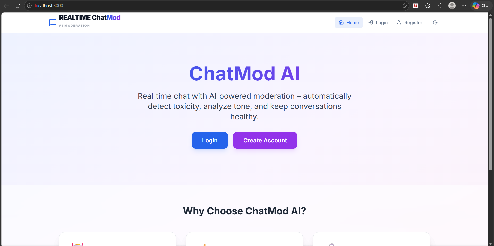
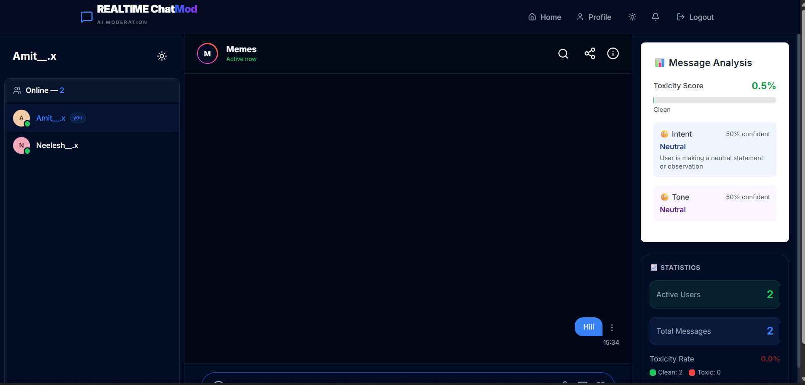
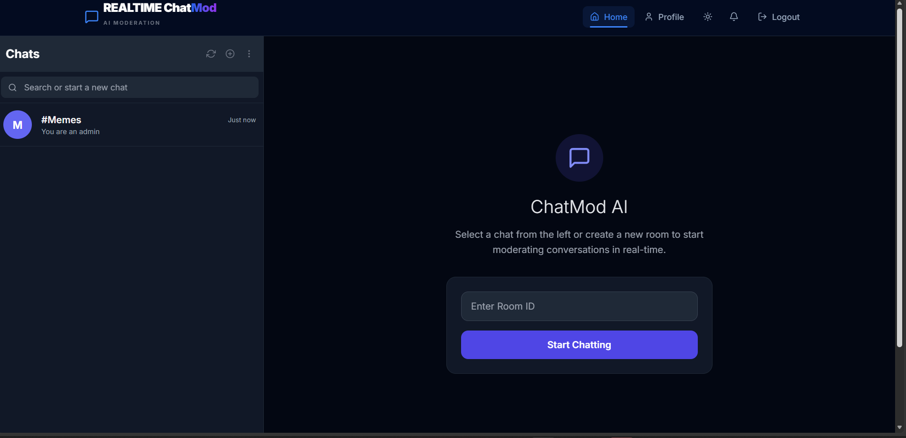

# Group Chat Realtime




Real-time group chat with AI-assisted moderation. The app combines a FastAPI backend, a Next.js frontend, WebSocket chat, authentication, and message analysis for toxicity, intent, and tone.

## What this project does

- Real-time chat rooms with live messaging
- User authentication with JWT tokens
- AI moderation signals for toxic language, intent, and tone
- Message editing, reactions, pinning, and room management features
- Profile views and user room access controls

## Project Structure

- `backend/` FastAPI application, models, ML helpers, and database setup
- `frontend/` Next.js application and UI components
- `datasets/` training and reference data used by moderation models
 
4. Start the API server.

Example:

```bash
cd backend
python -m venv .venv
.venv\Scripts\activate
pip install -r requirements.txt
uvicorn main:app --host 0.0.0.0 --port 8000 --reload
```

The backend reads its database connection from `DATABASE_URL`. SQLite is the easiest local option, while PostgreSQL is recommended for deployed environments.

## Frontend Setup

1. Install dependencies in `frontend/`.
2. Point the app at your backend API and WebSocket server.
3. Start the development server.

Example:

```bash
cd frontend
npm install
npm run dev
```

Set these environment variables for the frontend when needed:

- `NEXT_PUBLIC_API_URL` for the REST API base URL
- `NEXT_PUBLIC_WS_URL` for the WebSocket base URL

## Environment Variables

The backend expects values such as:

- `DATABASE_URL`
- `SECRET_KEY`
- `FRONTEND_URL`
- `OPENAI_API_KEY`
- `CLOUDINARY_CLOUD_NAME`
- `CLOUDINARY_API_KEY`
- `CLOUDINARY_API_SECRET`

Use `backend/.env.example` as the starting point, then replace any placeholder or local-only values before running the app.

## Useful Commands

Backend:

```bash
cd backend
uvicorn main:app --host 0.0.0.0 --port 8000 --reload
```

Frontend:

```bash
cd frontend
npm run dev
npm run build
npm start
```

---

## Screenshots

Quick visual overview — open this README on GitHub for best image quality.

- **Primary UI captures**

  
**Home page**

  
**Chat interface**

  
**Dashboard**

- **Additional captures (screenchots/)**

  
  
  
  
  
  
  


---

## Contact

Please provide the contact details you'd like to display (name, email, link to portfolio/GitHub, or phone). I'll insert them here formatted for sharing.


## Deployment Notes

The repo includes deployment guidance in `docs/DEPLOYMENT.md`. For production, make sure to:

- Use a real database instead of the default SQLite file
- Set a strong `SECRET_KEY`
- Configure CORS for your deployed frontend origin
- Verify `NEXT_PUBLIC_API_URL` and `NEXT_PUBLIC_WS_URL`
- Avoid loading heavy ML components at startup if your hosting plan has tight memory limits

Real-time group chat with AI-assisted moderation built with a FastAPI backend and a Next.js frontend. It delivers low-latency messaging, message-level moderation signals (toxicity, intent, tone), coaching rewrites, and analytics-ready persistence.

---

## Table of Contents

- Overview
- Features
- How it works
- Technologies
- Screenshots
- Installation
- Deployment notes
- Future enhancements
- Developer / Contact
- License

---

## Overview

`Group Chat Realtime` is a full-stack real-time chat application that combines WebSocket-based messaging with an AI moderation pipeline. Messages are analyzed for toxicity, intent, and tone; moderation signals and optional coaching rewrites are persisted alongside the message for transparency and analytics.

## Features

- **Real-time chat:** room-based WebSocket channels for low-latency messaging.
- **Authentication:** JWT-based auth for API and WebSocket access.
- **AI moderation:** toxicity detector, intent classifier, tone analyzer, and optional coaching/rewrite generation.
- **Message actions:** edit, pin, reply, react with emojis.
- **Room administration:** join/leave requests, pinned messages, user lists.
- **Persistence:** SQLAlchemy-backed database stores canonical moderation records for audit and analytics.

## How it works

*** End Patch
2. Backend normalizes the text and forwards it to the moderation pipeline.

3. Moderation modules return toxicity score, intent label, and tone analysis.

4. If needed, a coaching message or suggested rewrite is generated.

5. Structured message object (message + moderation metadata) is saved to the database.

6. Enriched payload is broadcast to room participants.

7. Analytics endpoints can consume persisted records for dashboards and reports.
